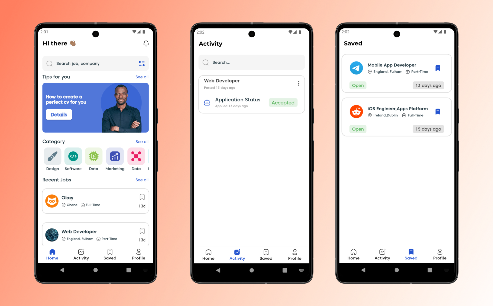
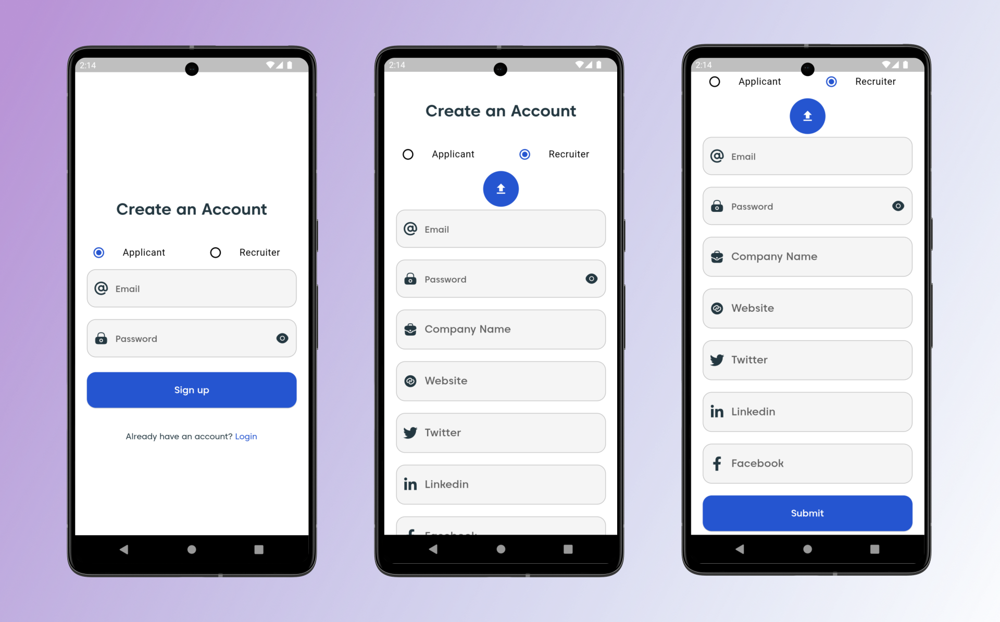

# Job Bhai

Job Bhai is an application that interconnected  recruiters and job applicants.

Feature

Recruiter Features:

- Post Jobs
- Active and Closed Jobs
- View All Applicants
- View Specific Applicant
- Accept and Reject Applications
- Insights

Applicant Features :

- Search for Jobs
- View Specific Job
- Apply for Jobs 
- Saved Jobs
- View Status of Applied Jobs

dependencies uses:

- Riverpod - State management

- Fpdart - Error handling

Appwrite for backend

This is the app UI. 

